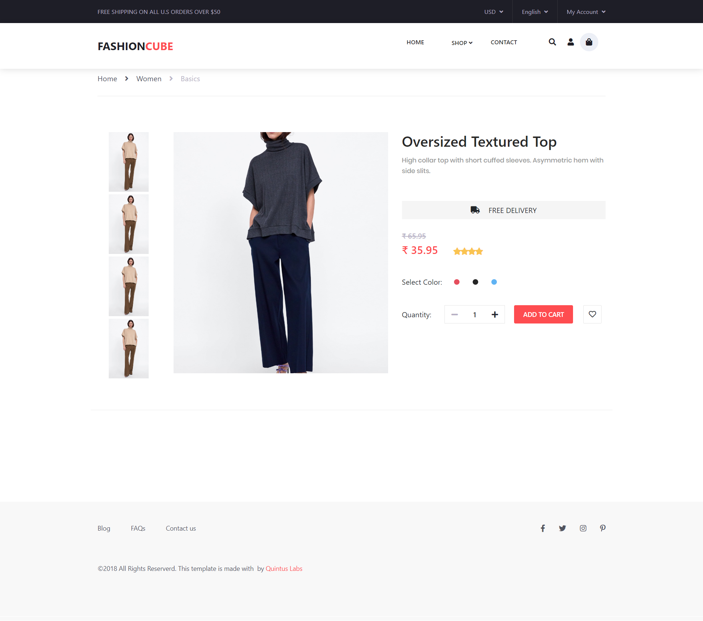
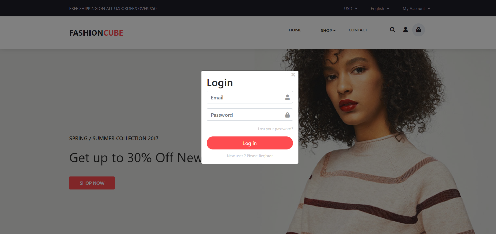

# Fashion Cube-Ecommerce Application

#General Info

front-end: Reactjs, Redux, Axios, Sass, react-bootstrap

[Live Demo](https://quintuslabs.github.io/fashion-cube)

## This project is created using:

- [x] Monorepo
- [x] Lerna
- [x] Design System
- [x] Hooks
- [x] Redux

## Future Features

- Home (List products)
- Detail products
- Product category
- Recommended products
- Cart
- Login / Register

# ScreenShot

